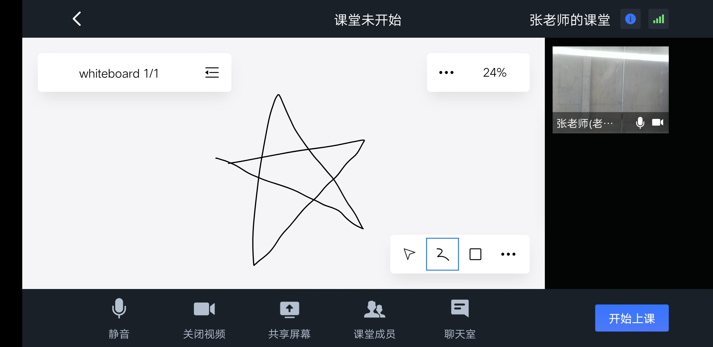
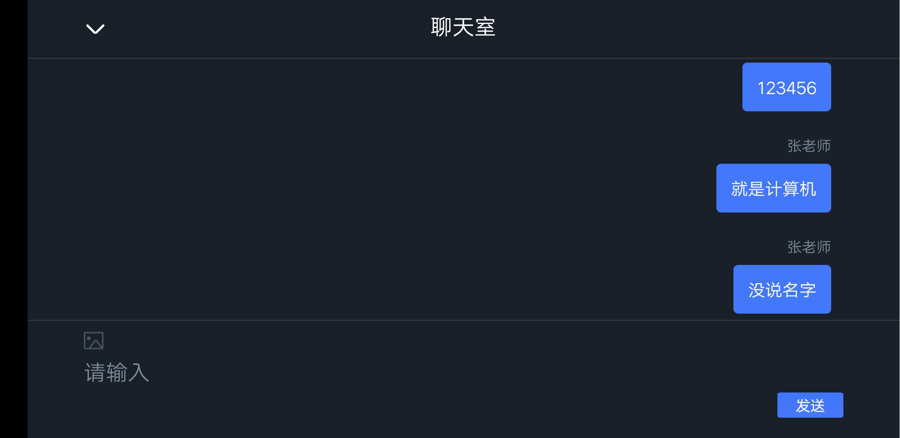
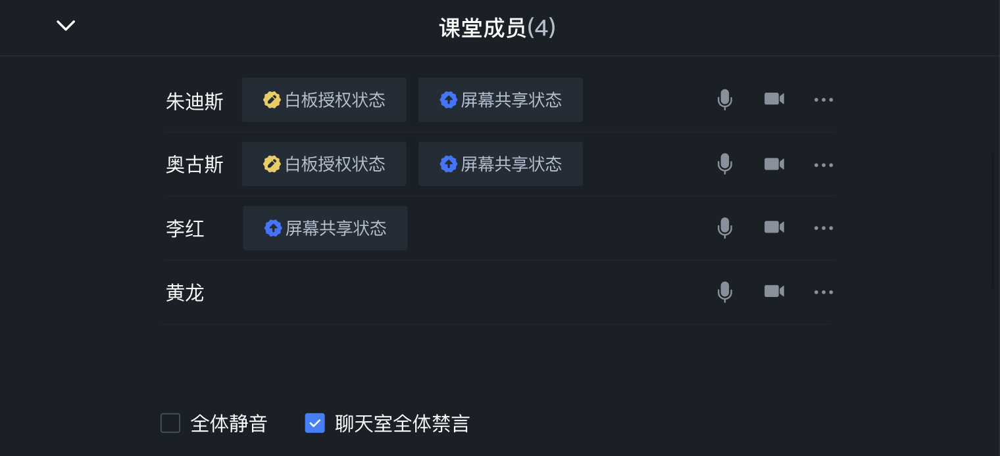

# 云信智慧云课堂组件（Android）

智慧云课堂（PaaS 方案）是网易云信提供的在线互动课堂场景解决方案。基于在线教育的常见场景，网易云信提供智慧云课堂开源项目，为您演示 1 对 1、小班课和大班课的典型方案。您可以直接基于我们的 Demo 修改适配，也可以参考 Demo，自行集成云信 IM SDK、音视频通话 2.0 NERTC SDK 和互动白板 SDK，实现在线教育场景。

效果展示：

课堂页面：



聊天页面：



课堂成员管理页面：



### 功能介绍

- 开始/结束上课

- 音视频通话

- 屏幕共享

- 白板绘制

- 聊天互动

- 举手上台

- 教师对学生权限控制（授予/收回白板编辑权限、授予/收回屏幕共享权限、开关音视频、全体禁言）

本文展示如何编译并运行 Android 平台的智慧云课堂示例项目，体验各个场景的在线课堂。

### 前提条件

在开始运行示例项目之前，请确保您已完成以下操作：

- 在云信控制台创建应用，并获取对应的 AppKey。

- 为此应用开通以下相关服务与抄送：
  - 产品服务：音视频通话 2.0、IM 专业版、聊天室、信令、互动白板、云端录制、点播。

- 产品功能：
  - 音视频通话 2.0 的云端录制和抄送功能。

- 互动白板的文档转码和云端录制功能。

- 音视频通话 2.0 抄送：1-房间启动、2-房间结束、3-房间录制文件下载信息抄送 、4-用户进入房间、5-用户离开房间、8-房间时长抄送。

```
注意：
```

- 开通相关产品功能与抄送，请联系[联系云信商务经理](https://yunxin.163.com/bizQQWPA.html)。
- `如果仅需要本地跑通示例项目，简单体验智慧云课堂，您可以使用智慧云课堂``体验账号``。体验账号已开通相关权限与抄送，课堂时长限制为 30 分钟。`
- 体验账号仅供开发者体验与测试，请勿在线上环境中使用。

### 开发环境

在开始运行示例项目之前，请确保开发环境满足以下要求：

| 环境要求         | 说明                                                         |
| ---------------- | ------------------------------------------------------------ |
| JDK 版本         | 1.8.0 及以上版本                                             |
| Android API 版本 | API 23、Android 6.0 及以上版本                               |
| CPU架构          | ARM64、ARMV7                                                 |
| IDE              | Android Studio                                               |
| 其他             | 依赖 Androidx，不支持 support 库。Android 系统 4.3 或以上版本的移动设备。 |

### 运行示例项目

1. 获取示例项目。

在智慧云课堂Demo体验页面下载需要体验的示例项目或 Demo 源码工程。

1. 开启 Android 设备的开发者选项，通过 USB 连接线将 Android 设备接入电脑。
2. 通过 Android Studio 打开项目。
3. 在示例项目中配置相关字段。

如果需要基于 Demo 开发自己的应用，在 `config.properties` 中将以下字段改为您的真实信息。

| 配置项        | 说明                                        |
| ------------- | ------------------------------------------- |
| APP_KEY       | 应用的 AppKey。可以在网易云信控制台中查看。 |
| AUTHORIZATION | 调用服务端接口时，请求头中的校验参数。      |

```
注意：如果仅需要本地跑通示例项目，您可以使用``网易云信体验账号``。体验账号的课堂时长限制为 30 分钟。
```

4. 选中设备直接运行，即可体验 Demo。

### 功能实现

示例项目结构：

```
├── app                      壳工程
├── base                     公共基础组件
├── edu-logic                教育核心业务模块
│   ├── cmd                 IM透传通知
│   ├── model               数据定义
│   ├── net.service         API接口请求      
│   ├── option              基础配置定义
│   └── service             业务服务
├── edu-ui                   UIKit组件
│   ├── clazz               各种房间Activity
├── im                       IM服务组件
├── rtc                      音视频通话服务组件
├── whiteboard               白板组件
└── config.properties        定义项目需要的各种配置信息
```

如果 Demo 中默认实现的 UI 不符合您的预期，您可以按需实现自己的用户界面，即只使用我们封装好的组件所提供的音视频能力，自行实现 UI 部分。

教育组件功能模块：



**EduUI：**包含教育组件的UI的实现，包括1v1、小班课、大班课场景的ViewController、View以及model部分。

**EduLogic：**是依赖云信的音视频SDK、IMSDK以及白板SDK对于教育逻辑的实现，分别对应NEEduRtcService、NEEduIMService、NEEduBoardService。

集成组件

### 1 集成到项目

1. 新建 Android 工程。
   a. 运行 Android Sudio，在顶部菜单依次选择 “File -> New -> New Project...” 新建工程。
   b. 选择 'Phone and Tablet' -> 'Empty Activity' ，并单击Next。
   c. 配置工程相关信息。

注意： Minimum API Level 为 API 21。

   d. 单击 'Finish'，完成工程创建。

2. 添加依赖模块。  
   a. 复制示例项目中的Modules和config.gradle、config.properties等相关配置文件至当前目录。
   b. settings.gradle引入Modules。

```
include ':edu-ui'
include ':edu-logic'
include ':whiteboard'
include ':im'
include ':rtc'
include ':base'
```

   c. 修改工程目录下的 'app/build.gradle' 文件，添加智慧云课堂 SDK相关的依赖。

```
allprojects {
    repositories {
        google()
        jcenter()
        maven{
            url 'https://oss.sonatype.org/content/repositories/snapshots/'
        }
    }
}


// 若出现 More than one file was found with OS independent path 'lib/arm64-v8a/libc++_shared.so'.

// 可以在主 module 的 build.gradle 文件中 android 闭包内追加如下 packageOptions 配置
android{
    //......
    packagingOptions {
      pickFirst 'lib/arm64-v8a/libc++_shared.so'
      pickFirst 'lib/armeabi-v7a/libc++_shared.so'
    }
}


dependencies {
    //......
    // 添加EduUI依赖
    implementation project(':edu-ui')
}
```

d. 在顶部菜单单击 'Build -> Make Project' 构建工程，下载依赖。

下载完成后即可在代码中引入 云课堂组件 中的类和方法。

3. 权限配置。

智慧云课堂 SDK 正常工作需要应用获取以下权限：

以上权限已经在SDK内部进行声明，开发者无需在`AndroidManifest.xml`文件中重新声明这些权限，但需要自己编码实现运行时的权限申请。运行时的权限可在应用首页中统一申请，详细信息请参考[Android运行时权限申请示例](https://developer.android.google.cn/guide/topics/permissions/overview)。

```
<!-- 网络相关 -->
<uses-permission android:name="android.permission.INTERNET" />
<uses-permission android:name="android.permission.ACCESS_NETWORK_STATE" />

<!-- 多媒体 -->
<uses-permission android:name="android.permission.READ_PHONE_STATE" />
<uses-permission android:name="android.Manifest.permission.READ_PHONE_STATE"/>

<uses-permission android:name="android.permission.FOREGROUND_SERVICE" />
```

### 2 初始化组件

步骤：

1. 进行全局配置

首先，创建 `NEEduOptions` 实例对 SDK 进行全局配置，然后调用 `config` 方法传入该实例。`NEEduOptions` 包含以下参数：

| 配置项        | 说明                                                         |
| ------------- | ------------------------------------------------------------ |
| APP_KEY       | 应用的 AppKey。可以在网易云信控制台中查看。                  |
| BASE_URL      | 应用服务器地址。私有化配置时需替换为私有化部署地址           |
| AUTHORIZATION | 调用服务端接口时，请求头中的校验参数。                       |
| reuseIM       | 配置是否复用底层NIM-SDK的长连接通道，默认关闭。仅当应用中同时还需独立接入和使用NIM-SDK，才需要开启该配置，其他情况下请忽略该配置。 |

```
NEEduUiKit.config(
    this,
    NEEduOptions(
        BuildConfig.APP_KEY,
        BuildConfig.AUTHORIZATION,
        BuildConfig.API_BASE_URL,
        reuseIM
    )
)
```

2. 初始化

配置完成后，创建 `NEEduUiKit` 实例，调用 `init` 方法进行初始化。包含以下参数：

| 配置项 | 说明                                            |
| ------ | ----------------------------------------------- |
| uuid   | 用户鉴权userUuid。匿名登录时请设置为空字符串""  |
| token  | 用户鉴权userToken。匿名登录时请设置为空字符串"" |

示例代码：

```
NEEduUiKit.init(uuid, token).observeOnce(viewLifecycleOwner, initObserver)
```

### 3 学生或老师加入课堂

学生或老师加入课堂时，会使用`NEEduClassOptions`的实例创建课堂并且加入，如果对应课堂号的课堂已经存在就直接加入。`NEEduClassOptions` 包含以下参数：

| 配置项    | 说明                                                         |
| --------- | ------------------------------------------------------------ |
| classId   | 课程号，课堂唯一标识                                         |
| className | 课程名称                                                     |
| nickName  | 用户在课堂中的昵称                                           |
| sceneType | 课堂类型，有三种类型： 1v1， 小班课， 大班课                 |
| roleType  | 角色类型：host：教育场景中映射为老师，broadcaster: 教育场景中映射为学生 |

示例代码：

```
eduManager.enterClass(neEduClassOptions).map {
    if (it.success()) {
        if (neEduClassOptions.roleType == NEEduRoleType.HOST) {
            when (neEduClassOptions.sceneType) {
                NEEduSceneType.ONE_TO_ONE -> {
                    OneToOneTeacherActivity.start(context)
                }
                NEEduSceneType.SMALL -> {
                    SmallClazzTeacherActivity.start(context)
                }
                NEEduSceneType.BIG -> {
                    BigClazzTeacherActivity.start(context)
                }
            }
        } else {
            when (neEduClassOptions.sceneType) {
                NEEduSceneType.ONE_TO_ONE -> {
                    OneToOneStudentActivity.start(context)
                }
                NEEduSceneType.SMALL -> {
                    SmallClazzStudentActivity.start(context)
                }
                NEEduSceneType.BIG -> {
                    BigClazzStudentActivity.start(context)
                }
            }

        }

    }

    it

}
```

### 4 实现提问互动

教学双方加入教室后，开启课程。智慧云课堂提供了丰富的课堂功能，如：互动白板、屏幕共享、举手、视频、语音等。

1. 开始上课。

教师端开始上课。示例代码：

```
// 教师端开始上课
eduManager.getRoomService().startClass(roomUuid = eduRoom.roomUuid)
    .observe(this@BaseClassActivity, {
        ALog.i(tag, "startClazz")
    })
```

2. 学生管理。  
   a. 教师端调用 remoteUserVideoEnable、remoteUserAudioEnable 方法控制学生端的摄像头和麦克风。如果需要和学生互动，可以开启对方的麦克风。示例代码：

```
// 控制学生打开摄像头

eduManager.roomConfig.memberStreamsPermission()?.apply {
    val self = entryMember
    video?.let { it ->
        // 首先检查自己是否有权限
        if (it.hasAllPermission(self.role)) {
            // 接着调用remoteUserVideoEnable打开指定userUuid学生的摄像头
            eduManager.getRtcService().remoteUserVideoEnable(userUuid, true)
                .observe(this@BaseClassActivity, {
                    // 最后处理结果回调
                    ALog.i(tag, "switchRemoteUserVideo")
                    ToastUtil.showShort(R.string.operation_successful)
                })
        }
    }
}


// 控制学生打开音频

eduManager.roomConfig.memberStreamsPermission()?.apply {
    val self = entryMember
    audio?.let { it ->
        // 首先检查自己是否有权限
        if (it.hasAllPermission(self.role)) {
            // 接着调用remoteUserAudioEnable打开指定userUuid学生的音频
            eduManager.getRtcService().remoteUserAudioEnable(member.userUuid, !member.hasAudio())
                .observe(this@BaseClassActivity, {
                    // 最后处理结果回调
                    ALog.i(tag, "switchRemoteUserAudio")
                    toastOperateSuccess()
                })
        }
    }
}
```

   b. 教师端调用 grantPermission方法授权学生使用白板或屏幕共享。示例代码：

```
// 授权学生使用白板
eduManager.roomConfig.memberPropertiesPermission()?.apply {
    val self = entryMember
    whiteboard?.let { it ->
        // 首先检查自己是否有权限
        if (it.hasAllPermission(self.role)) {
            // 接着调用grantPermission授权学生使用白板
            eduManager.getBoardService().grantPermission(member.userUuid, !member.isGrantedWhiteboard())
                .observe(this@BaseClassActivity, {
                    // 最后处理结果回调
                    ALog.i(tag, "grantWhiteboardPermission")
                })
        }
    }
}
```

3. 屏幕共享。

教师端或学生端调用 startScreenCapture 发起屏幕共享，共享本端屏幕给其他人观看。示例代码：

```
// 发起屏幕共享
// 首先创建屏幕共享配置实例
val config = NERtcScreenConfig().apply {
    contentPrefer = NERtcScreenConfig.NERtcSubStreamContentPrefer.CONTENT_PREFER_DETAILS
    videoProfile = RTCVideoProfile.kVideoProfileHD1080p
}
// 接着发起本地屏幕共享
eduManager.getShareScreenService().startScreenCapture(config, data, object :
    MediaProjection.Callback() {
    override fun onStop() {
        // 最后处理结果回调
        runOnUiThread { stopLocalShareScreen() }
    }
})
```

4. 在线聊天室。

在 1 对 1 和互动大班课中，可以通过聊天室实现消息收发，学生和学生、学生和老师之间通过聊天室发送文字或图片消息，教师端可以禁言或解禁聊天室。

师生调用 enterChatRoom 加入聊天室，并通过 sendMessage发送文字和图片消息。示例代码：

```
// 发起加入聊天室
// 首先创建EnterChatRoomData实例
val data = EnterChatRoomData(activity.eduRoom?.chatRoomId())
// 接着使用EnterChatRoomData实例进入聊天室
imService.enterChatRoom(data).observe(this, { it ->
    // 最后处理结果回调
    if (it.success()) roomInfo = it.data!!.roomInfo
    it
}


// 发送文本消息
// 首先创建文本消息
val chatMessage = ChatRoomMessageBuilder.createChatRoomTextMessage(it.roomId, text)
// 接着发送消息
imService.sendMessage(chatMessage)


// 发送图片消息
// 首先创建图片消息
val chatMessage =
    ChatRoomMessageBuilder.createChatRoomImageMessage(it.roomId, file, file?.name)
// 接着发送消息
imService.sendMessage(chatMessage)
```

### EduLogic API

**NEEduLogic组件的 API 接口列表如下：**

- `**NEEduUiKit**`**单例类，提供SDK配置，SDK初始化等基础能力，同时获取NEEduManager。**

| 接口                                                   | 备注              |
| ------------------------------------------------------ | ----------------- |
| config(context: Application, eduOptions: NEEduOptions) | 该接口用于SDK配置 |
| init()                                                 | 初始化组件        |
| enterClass(neEduClassOptions: NEEduClassOptions)       | 加入课堂          |

- `**NEEduManager**`**单例类，使用SDK提供的各种业务服务。**

| 接口                  | 备注             |
| --------------------- | ---------------- |
| getRoomService        | 获得课堂管理服务 |
| getMemberService      | 获得课堂成员服务 |
| getRtcService         | 获得音视频服务   |
| getIMService          | 获得消息聊天服务 |
| getShareScreenService | 获得屏幕共享服务 |
| getBoardService       | 获得白板服务     |
| getHandsUpService     | 获得举手上台服务 |
| destroy()             | 销毁对象         |

- `**NEEduRoomService：课堂管理类。**`

| 接口                    | 备注                   |
| ----------------------- | ---------------------- |
| startClass              | 老师开始课堂           |
| finishClass:            | 老师结束课堂           |
|                         |                        |
| 回调方法                | 备注                   |
| onCurrentRoomInfo       | 当前课堂详情变化通知。 |
| onRoomStatesChange:     | 房间状态通知           |
| onNetworkQualityChange: | 网络变更通知           |

- `**NEEduMemberService：**``***课堂成员***``**管理类。**`

| 接口                     | 备注                     |
| ------------------------ | ------------------------ |
| getMemberList            | 获取当前课堂成员详情列表 |
| getLocalUser             | 获取当前用户             |
|                          |                          |
| 回调方法                 | 备注                     |
| onMemberJoin             | 成员在线状态变化通知     |
| onMemberLeave            | 成员离开房间通知         |
| onMemberPropertiesChange | 成员属性变化通知         |

- `**NEEduRtcService**`**：音视频管理类。**

| 接口                   | 备注                                   |
| ---------------------- | -------------------------------------- |
| muteAllAudio:          | 发送全体静音。                         |
| updateRtcAudio:        | 设置音频，会开关硬件                   |
| enableLocalVideo:      | 开关本地视频，会开关硬件               |
| updateRtcVideo:        | 设置成员的视频视图                     |
| updateRtcSubVideo:     | 设置辅流视频                           |
| localUserVideoEnable:  | 取消/发送本地视频，不开关硬件          |
| localUserAudioEnable:  | 取消/发送本地音频，不开关硬件          |
| remoteUserVideoEnable: | 老师开关远程视频                       |
| remoteUserAudioEnable: | 老师开关远程音频                       |
| destroy                | 离开音视频房间。                       |
|                        |                                        |
| 回调方法               | 备注                                   |
| onMuteAllAudio:        | 全体静音通知                           |
| onStreamChange:        | 流状态（音频、视频、辅流视频）变化通知 |

- `**NEEduIMService**`**：聊天管理类。**

| 接口                        | 备注                        |
| --------------------------- | --------------------------- |
| sendMessage:                | 发送消息。                  |
| muteAllChat:                | 发送全体聊天禁言            |
| enterChatRoom:              | 加入聊天室                  |
| exitChatRoom:               | 退出聊天室                  |
|                             |                             |
| 回调方法                    | 备注                        |
| onReceiveMessage:           | 聊天消息通知。              |
| onMessageStatusChange:      | 图片消息状态变化通知。      |
| onAttachmentProgressChange: | 消息附件上传/下载进度通知。 |

- `**NEEduShareScreenService**`**：屏幕共享管理类。**

| 接口                | 备注                             |
| ------------------- | -------------------------------- |
| grantPermission:    | 授权或取消授权成员的屏幕共享权限 |
| shareScreen         | 发送屏幕共享，不开关截屏         |
| finishShareScreen   | 取消屏幕共享，不开关截屏         |
| startScreenCapture  | 开始屏幕共享                     |
| stopScreenCapture   | 停止屏幕共享                     |
|                     |                                  |
| 回调方法            | 备注                             |
| onPermissionGranted | 屏幕共享权限发生变化             |
| onScreenShareChange | 屏幕共享状态变更                 |

- `**NEEduBoardService**`**：白板管理类。**

| 接口                 | 备注                         |
| -------------------- | ---------------------------- |
| grantPermission:     | 授权或取消授权成员的白板权限 |
| initBoard            | 初始化白板                   |
| setEnableDraw        | 设置是否允许绘制             |
|                      |                              |
| 回调方法             | 备注                         |
| onPermissionGranted: | 白板权限变化通知             |

- `**NEEduHandsUpService**`**：举手上台（适用于大班课场景）管理类。**

| 接口                  | 备注                     |
| --------------------- | ------------------------ |
| getHandsUpApplyList:  | 获取当前举手中的成员详情 |
| getOnStageMemberList  | 获取当前台上成员详情     |
| handsUpStateChange    | 改变举手状态             |
|                       |                          |
| 回调方法              | 备注                     |
| onHandsUpStateChange: | 学生台上状态发生变化     |